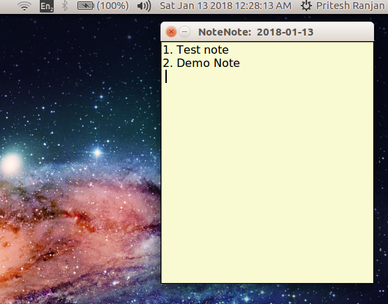
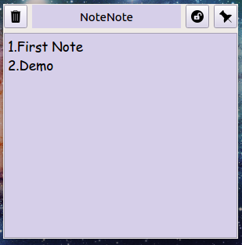
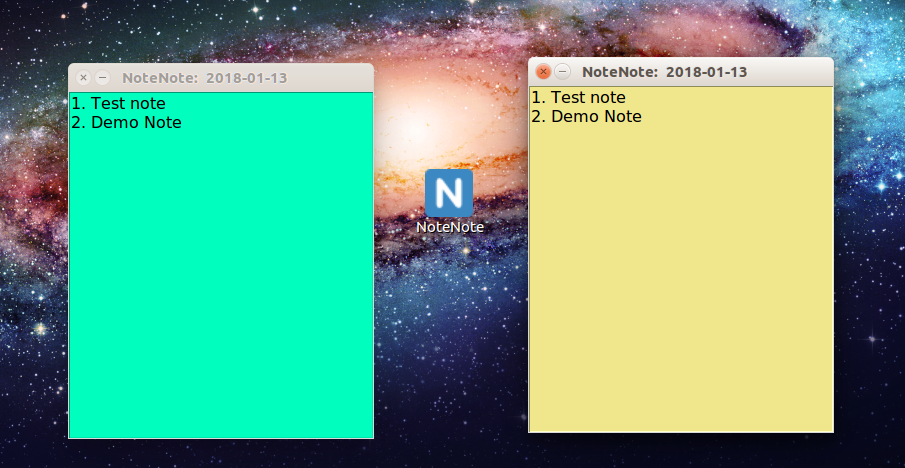

# NoteNote

 
NoteNote sticky note app written in python3 with tkinter gui.
It can be used as an alternative to the sticky notes feature on the new windows 10 devices.

## Screenshots

    



## Usage

```bash
cd NoteNote
python3 NoteNote.py
```

You can also add this to start up applications.

## Requirements

Install python3 and tkinter for python3

```bash
sudo apt-get install python3-tk
```

## Credits for icon

Icon made by Twitter from Flaticon
url: www.flaticon.com