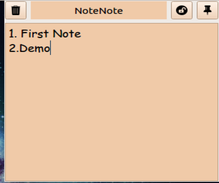

# NoteNote

 
NoteNote sticky note app written in python3 with tkinter gui.
It can be used as an alternative to the sticky notes feature on the new windows 10 devices.

## Screenshots

    

## Usage

```bash
cd NoteNote
python3 NoteNote.py
```

You can also add this to start up applications.
You might want to run install.sh to automatically install this application into your system with all dependencies and automatically run at startup. 

## Requirements

Install PyQt5 for python3

```bash
pip3 install PyQt5
```

## Credits for icon

Icon made by Twitter from Flaticon
url: www.flaticon.com